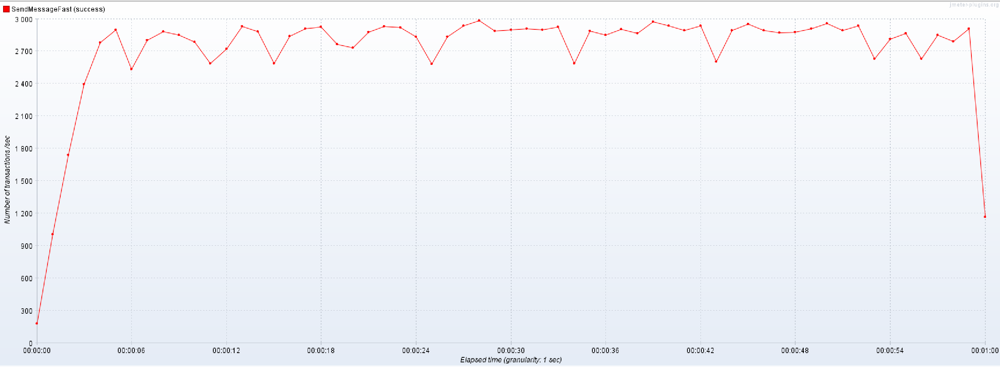

# hw6 dialog

### Инструкция

Выделенный сервис под хранение только диалогов. Для оптимизации сохранения новых сообщений добавлен слой кеша/редиса,
который аккумулирует в себе список сообщений с ключем = dialogId. При накоплении определенного размера сообщений в
каждом диалоге сервис забирает и удаляет из кеша сообщения и сохраняет их в Postgres через batch insert. За счет такой
оптимизации ускорение составляет порядка 75%. При этом сообщения также доступны для чтения из кеша.

Нагрузочное тестирование проводилось на прямую над сервисом диалогом, 10 тредов в течении 60 секунд с разогревом в 5
секунд:

ДО, RPS=1602.5 req/sec:   

ПОСЛЕ(батч=100), RPS=2766.9 req/sec   

Увеличение размера батча выше 100 существенного увеличения производительности не вносит

### install

mvn clean install
docker build -f docker/Dockerfile.jvm -t otus-highload-hw6:latest .
docker images

### publish

docker tag otus-highload-hw7:latest recvezitor/otus-highload-hw6:latest
docker login -> recvezitor/password
docker push recvezitor/otus-highload-hw7:latest

### deploy

docker compose -f ./docker/docker-compose.yml
